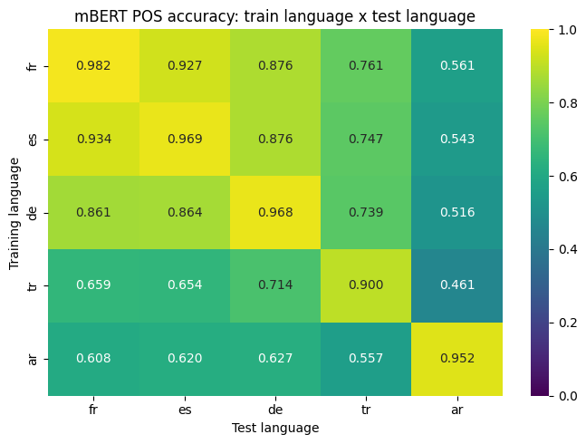
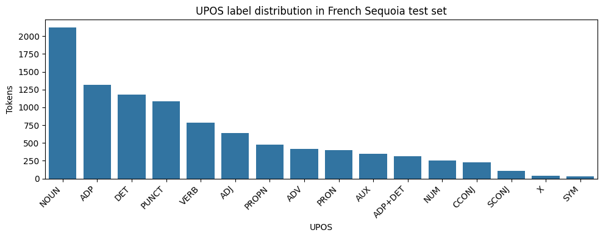

# How Multilingual is Multilingual BERT?

Cross-lingual part-of-speech tagging with **`bert-base-multilingual-cased`**, fine-tuned on five Universal Dependencies treebanks and evaluated as a 5 × 5 transfer matrix.

**Course:** Theory and Practice of Large Language Models, M1 Computational Linguistics, Université Paris Cité (Spring 2026)
**Instructor:** Guillaume Wisniewski
**Author:** Mohammad Ebrahim Sharifi

---

## Headline finding

mBERT shows strong cross-lingual transfer within the Indo-European Latin-script subset of its training data, but transfer breaks down sharply when the source and target language differ in family, morphological type, or script.

---

## Languages

| Code | Treebank | Family | Script | Morphology |
|------|----------|--------|--------|------------|
| `fr` | UD_French-GSD | Indo-European (Romance) | Latin | Light |
| `es` | UD_Spanish-GSD | Indo-European (Romance) | Latin | Light |
| `de` | UD_German-GSD | Indo-European (Germanic) | Latin | Richer case morphology |
| `tr` | UD_Turkish-IMST | Turkic | Latin | Agglutinative |
| `ar` | UD_Arabic-PADT | Afro-Asiatic (Semitic) | Arabic | Templatic |

A French Sequoia test set is used separately for the warm-up inspection (Section 2 of the report).

---

## Results: 5 × 5 transfer matrix

Rows = training language. Columns = test language. Cells = PoS tagging accuracy on non-pad positions.

| Train \ Test | fr | es | de | tr | ar |
|---|---|---|---|---|---|
| **fr** | **0.982** | 0.927 | 0.876 | 0.761 | 0.561 |
| **es** | 0.934 | **0.969** | 0.876 | 0.747 | 0.543 |
| **de** | 0.861 | 0.864 | **0.968** | 0.739 | 0.516 |
| **tr** | 0.659 | 0.654 | 0.714 | **0.900** | 0.461 |
| **ar** | 0.608 | 0.620 | 0.627 | 0.557 | **0.952** |

Diagonal entries are monolingual; off-diagonal entries measure zero-shot cross-lingual transfer.

---

## Corpus sizes (after MWT normalisation)

| Language | Split | Sentences | Tokens |
|---|---|---|---|
| French | train | 14,450 | 344,961 |
| French | dev | 1,476 | 34,664 |
| French | test | 416 | 9,738 |
| Spanish | train | 14,186 | 375,031 |
| Spanish | dev | 1,400 | 36,461 |
| Spanish | test | 427 | 11,733 |
| German | train | 13,813 | 259,167 |
| German | dev | 799 | 12,316 |
| German | test | 977 | 16,225 |
| Turkish | train | 3,435 | 36,415 |
| Turkish | dev | 1,100 | 10,257 |
| Turkish | test | 1,100 | 9,750 |
| Arabic | train | 6,075 | 191,869 |
| Arabic | dev | 909 | 25,986 |
| Arabic | test | 680 | 24,201 |

Turkish IMST is roughly one quarter the size of the IE Latin-script treebanks; this is acknowledged as a corpus-size confound in the analysis.

---

## Truncation statistics

mBERT truncates at 512 subword tokens. The table below confirms that truncation is essentially absent in this experiment, and entirely absent on every test set.

| Language | Split | Sentences truncated | Words dropped | % truncated |
|---|---|---|---|---|
| French | train | 1 | 34 | 0.007 |
| Arabic | train | 1 | 63 | 0.016 |
| *all other splits* | | 0 | 0 | 0.000 |

---

## Sequoia warm-up

The French Sequoia test set is used for the inspection questions (label distribution, multiword tokens, tokens containing spaces). The MWT-merge rule used throughout this work keeps composite tokens like `au` (= `à` + `le`) as a single token with the concatenated label `ADP+DET`.

---

## How to reproduce

1. Open `Lab5_multilingual_mBERT_FINAL_colab.ipynb` in Google Colab.
2. **Runtime → Change runtime type → T4 GPU**.
3. **Runtime → Run all**. The first cell installs dependencies; the data-download cell pulls UD treebanks from GitHub `master`.
4. The notebook mounts Google Drive and persists checkpoints, final models, and partial result matrices to `MyDrive/lab5_mbert_pos/`. If Colab disconnects, re-running the notebook resumes from completed rows.

Single run, seed = 13. Library versions are not pinned; the run used the latest PyPI versions of `transformers`, `datasets`, and `conllu` at the time of execution (May 2026).

---

## Methodology summary

- **Model:** `bert-base-multilingual-cased`, fine-tuned for token classification.
- **Hyperparameters:** 3 epochs, batch size 16, learning rate 2e-5, weight decay 0.01, `load_best_model_at_end=True` on dev accuracy.
- **Label inventory:** 141 labels (17 universal POS tags plus 124 language-specific MWT composites).
- **Alignment rule:** First subword of each UD word carries the gold label; continuation subwords, special tokens ([CLS], [SEP]), and padding are masked with `-100`.
- **Metric:** Per-token accuracy on non-pad positions.

---

## Limitations

- Turkish IMST has ~¼ the training data of the IE Latin-script treebanks; some of Turkish's weaker cross-lingual numbers may reflect this rather than typological distance alone.
- The 141-label inventory contains language-specific MWT composites (`ADP+DET`, `CCONJ+ADP+DET`, …) that the source-language model cannot produce for target-language compounds, which systematically depresses cross-lingual scores.
- Choosing both French and Spanish duplicates the within-Romance condition. A stronger design would have included Persian (Indo-European, Arabic script) to cleanly separate script from family.
- Fragmentation rate (subtokens per word) is hypothesised to drive Turkish's transfer asymmetry but was not directly measured in this experiment.

---

## References

- Pires, T., Schlinger, E., Garrette, D. (2019). *How Multilingual is Multilingual BERT?* ACL.
- Nivre, J. et al. Universal Dependencies. <https://universaldependencies.org>
- Devlin, J. et al. (2019). *BERT: Pre-training of Deep Bidirectional Transformers for Language Understanding.* NAACL-HLT.